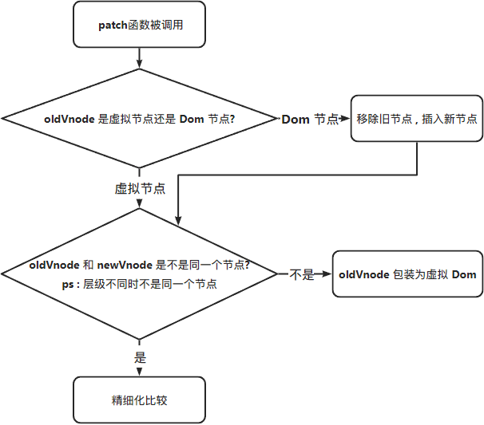

# 虚拟 Dom 和 diff 算法

- 虚拟 Dom

  - 在浏览器环境中 , 会有一个 Dom 树的概念 , 而频繁操作这个 Dom 树就会有很多性能上的浪费 , 所以在主流的框架中就引入了虚拟 Dom 的说法 , 这样就避免了在频繁操作真实 Dom 所带来的性能浪费 .
  - 虚拟 Dom 用 JS 对象描述 Dom 的层次结构 , Dom 中的一切属性都在虚拟 Dom , 中对应的属性 .

- diff 算法

- 基于虚拟 Dom 的概念 , 我们知道当需要重新渲染的时候 , 都会先操作虚拟 Dom ( Vnode ) , 然后在将最终的虚拟 Dom 树同步到真实 Dom ( path ) , 但在渲染真实 Dom 之前 , 虚拟 Dom 会通过 diff 算法去比对 newVnode 和 oldVnode , 也就是去对比新的虚拟 Dom 信息和旧的 虚拟 Dom 信息 , 从而做到当虚拟 Dom 更新后 , 只用执行一次渲染真实 Dom 的操作 , 减少频繁操作真实 Dom 的次数提高页面性能 .
- ps : diff 算法是发生在虚拟 Dom 上的 , 新虚拟 Dom 和老的虚拟 Dom 进行 diff 比较 , 算出如何最小化更新 , 最后反映到真正的 Dom

## 手写虚拟 Dom 和 diff 算法实现过程

### 简介

​ 简单介绍一下 [snabbdom](https://github.com/snabbdom/snabbdom/blob/master/README-zh_CN.md) 这个 JS 库 , 著名的虚拟 Dom 库 , diff 算法的鼻祖 , Vue 的源码就借鉴了它 .

### 环境准备

- 创建新文件夹
- 下载 snabbdom

```javascript
pnpm i snabbdom
```

- 下载 vite

```javascript
pnpm i -D vite
```

- 打开 vite.config.js , 配置 输出目录

```javascript
import { fileURLToPath, URL } from 'node:url'

import { defineConfig } from 'vite'

// https://vitejs.dev/config/
export default defineConfig({
  resolve: {
    alias: {
      '@': fileURLToPath(new URL('./src', import.meta.url)) // 相对路径别名配置 , 使用 @ 代替 src
    },
    // vite 打包配置
    build: {
      // 指定输出路径(相对项目根目录)
      outDir: 'dist'
    }
  }
})
```

- 在项目跟目录创建 index.html 作为入口文件 , 并引入 js 模块

```html
<!DOCTYPE html>
<html lang="en">
  <head>
    <meta charset="UTF-8" />
    <meta http-equiv="X-UA-Compatible" content="IE=edge" />
    <meta name="viewport" content="width=device-width, initial-scale=1.0" />
    <title>Document</title>
  </head>
  <body>
    <!-- 默认示例中的容器 -->
    <div id="container"></div>
    <!-- 这里路名默认是 根目录 src 下的 index.js  -->
    <!-- 没有 src 也可以不用创建 直接 ./main.js -->
    <script type="module" src="src/main.js"></script>
  </body>
</html>
```

- 修改 main.js 内容

```javascript
console.log('helloWord', '< ::helloWord')
```

- 修改 package.json 中的启动指令

```json
{
  "name": "snabbdom",
  "version": "1.0.0",
  "description": "",
  "main": "index.js",
  "scripts": {
    "dev": "vite dev --mode dev" // 修改为 vite 的 dev 配置
  },
  "keywords": [],
  "author": "",
  "license": "ISC",
  "dependencies": {
    "snabbdom": "^3.5.1"
  },
  "devDependencies": {
    "vite": "^4.3.9"
  }
}
```

- 命令行运行

```javascript
pnpm run dev
// 此时打开 localhost 可以看到控制台的 log 信息 , 说明配置完成
```

- 复制 snabbdom 官网示例代码到 main.js

```javascript
import { init, classModule, propsModule, styleModule, eventListenersModule, h } from 'snabbdom'

const patch = init([
  // 通过传入模块初始化 patch 函数
  classModule, // 开启 classes 功能
  propsModule, // 支持传入 props
  styleModule, // 支持内联样式同时支持动画
  eventListenersModule // 添加事件监听
])

const container = document.getElementById('container')

const vnode = h('div#container.two.classes', { on: { click: someFn } }, [
  h('span', { style: { fontWeight: 'bold' } }, 'This is bold'),
  ' and this is just normal text',
  h('a', { props: { href: '/foo' } }, "I'll take you places!")
])
// 传入一个空的元素节点 - 将产生副作用（修改该节点）
patch(container, vnode)

const newVnode = h('div#container.two.classes', { on: { click: anotherEventHandler } }, [
  h('span', { style: { fontWeight: 'normal', fontStyle: 'italic' } }, 'This is now italic type'),
  ' and this is still just normal text',
  h('a', { props: { href: '/bar' } }, "I'll take you places!")
])
// 再次调用 `patch`
patch(vnode, newVnode) // 将旧节点更新为新节点
```

- 至此环境就准备完成了 , 浏览器上会显示 ` This is now italic type and this is still just normal textI'll take you places!`

### 创建一个虚拟 Dom 并渲染到真实 Dom

- h 函数用来产生虚拟节点 ( Vnode ) , 在 vue3 中也有相关讲解 , 可以参考 [渲染函数 API](https://cn.vuejs.org/api/render-function.html#h) 和 [渲染函数 & JSX](https://cn.vuejs.org/guide/extras/render-function.html#creating-vnodes) .

- 首先我们先创建一个虚拟节点

```javascript
import { h } from 'snabbdom'

// 创建虚拟节点
const myVnode = h('a', { props: { href: 'https://www.baidu.com' } }, '创建一个 a 标签')
console.log(myVnode, '< ::myVnode')
// {
//   children: undefined;
//   data: {props:{href: "https://www.baidu.com"}}; 属性样式
//   elm: undefined; 元素对应的真正的dom节点 如果是 undefined 说明还没有渲染到真实 Dom 树
//   key: undefined; 唯一标识
//   sel: "a"; 选择器
//   text: "创建一个 a 标签"; 文字
// }
```

- 但此时发现页面上并没有我们所创建的 a 标签 , 因为我们只是创建了虚拟 Dom 还没有渲染到真实 Dom , 并且在 控制台 Elements 中 , 此时的默认容器还是`id = " container " 的 div `

- 创建 patch 函数 , 这是渲染到真实 Dom 的核心函数 , 并引入相关模块

  ```javascript
  import { h, init, classModule, propsModule, styleModule, eventListenersModule } from 'snabbdom'
  // 创建 patch 函数 , 这是虚拟 Dom 渲染到 真实 Dom 的核心模块
  const patch = init([
    classModule, // 类名模块
    propsModule, // Dom 元素的属性模块
    styleModule, // Dom 元素的样式模块
    eventListenersModule // 事件监听模块
  ])
  // 调用 patch 函数 , 渲染到真实 Dom
  //获取到需要渲染的 dom 元素
  const container = document.querySelector('#container')
  patch(container, myVnode)
  ```

- 此时页面上显示了我们所创建的 a 标签 , 并且`id = " container " 的 div ` 也已经不存在了

- ps : 这里要注意的是通过 patch 方法 , **一个容器只能绑定一个虚拟 Dom 并渲染** , 如果需要渲染多个要采用嵌套的模式

#### 嵌套使用 h 函数 ( ✨ )

```javascript
const myVnode = h('div', [
  h('ul', [h('li', 'li-1'), h('li', 'li-2')]),
  h('p', 'B'),
  h('div', [h('span', 'span-1'), h('span', 'span-2'), h('span', 'span-3')])
])
console.log(myVnode, '< ::')
//获取到需要渲染的 dom 元素
const container = document.querySelector('#container')
// 渲染到真实 Dom
patch(container, myVnode)
```

- 当嵌套使用 h 函数时候 , 要注意一点 , 当 h 函数内部内部有嵌套内容的时候 , 如果传入了 text 的信息 , 则会直接渲染 text 的文本内容 , 就不会渲染所嵌套的内容 , 这里以 `div 标签` 为例 , 稍后的手写 h 函数做出了解答

```javascript
  h("div", [h("span", "span-1"), h("span", "span-2"), h("span", "span-3")])
// 此时对应的虚拟 Dom 信息
// {
//   children: (3)[({...}, {...}, {...})];
//   data: {}
//   elm: div;
//   key: undefined;
//   sel: "div";
//   text: undefined;
// }
// 可以看到 此 `div标签` 的虚拟 Dom 信息中的 text 是 undefined , 页面上会正常显示三个 `span` 标签
// 如果改造成这样
  h("div",[h("span", "span-1"), h("span", "span-2"), h("span", "span-3")],"div 的内容"),
// 此时的对应虚拟 Dom 的信息中的 text 是 `div 的内容` , 而不会显示 `span` 标签 , 这是实际操作中碰到的问题 , 还没完善 , 留个待办事项 , 但猜测是 text 的渲染优先级 高于 children
```

### 手写 h 函数

打开 node_modules/snabbdom/src/h.ts , 这里就是 h 函数的源码 , 图中的判断是在进行函数重载 , 就是一个函数有多种用法 , h 函数的入参可以看到 , b 和 c 的参数也是非必要的 , 而只有在 TS 中才能把标签头罗列下来 , 这是 TS 独有的 . 本次就默认只考虑最后三种情况作为示范

- `h("div")`
- `h("div", "文字")`
- `h("div", [])`
- `h("div", h())`
- `h("div", {}, [])` 简易版类型一
- `h("div", {}, "text")` 简易版类型二
- `h("div", {}, h())` 简易版类型三

```typescript
// Ts 独有的罗列标签头 , js 中无法使用 , 当打包成 js 文件时只会显示一个 h 函数
export function h(sel: string): VNode
export function h(sel: string, data: VNodeData | null): VNode
export function h(sel: string, children: VNodeChildren): VNode
export function h(sel: string, data: VNodeData | null, children: VNodeChildren): VNode
export function h(sel: any, b?: any, c?: any): VNode {
  let data: VNodeData = {}
  let children: any
  let text: any
  let i: number
  // 这些判断就是函数重载 , 一个 h 函数有多种昂用法
  if (c !== undefined) {
    if (b !== null) {
      data = b
    }
    if (is.array(c)) {
      children = c
    } else if (is.primitive(c)) {
      text = c.toString()
    } else if (c && c.sel) {
      children = [c]
    }
  } else if (b !== undefined && b !== null) {
    if (is.array(b)) {
      children = b
    } else if (is.primitive(b)) {
      text = b.toString()
    } else if (b && b.sel) {
      children = [b]
    } else {
      data = b
    }
  }
  if (children !== undefined) {
    for (i = 0; i < children.length; ++i) {
      if (is.primitive(children[i]))
        children[i] = vnode(undefined, undefined, undefined, children[i], undefined)
    }
  }
  if (
    sel[0] === 's' &&
    sel[1] === 'v' &&
    sel[2] === 'g' &&
    (sel.length === 3 || sel[3] === '.' || sel[3] === '#')
  ) {
    addNS(data, children, sel)
  }
  return vnode(sel, data, children, text, undefined)
}
```

- 简单复刻版本
  - 因为简单版本只提取了核心思路 , 当传参不同时判断的条件也就更多 , 这里就简单对第三个参数进行了判断 , 这里可以使用我们自己创建的 h 函数结合 snabbdom 的 patch 直接渲染到真实 Dom 树

```javascript
// src/h/index.js
const vnode = function (sel, data, children, text, elm) {
  return { sel, data, children, text, elm }
}
/**
 * 低配版 h 函数 , 必须接受三个参数 , 调用的参数必须是三者之一 , 因为第三项不确定所以入参取名 c
 * @params string
 * @params {Object}
 * @params 类型一 : [] || 类型二 : string || 类型三 : h()
 */
export const h = function (sel, data, c) {
  if (arguments.length !== 3) throw new Error('参数错误,h 函数至少传入三个参数')
  if (typeof c === 'string' || typeof c === 'number') {
    //调用类型二

    return vnode(sel, data, undefined, c, undefined)
  } else if (Array.isArray(c)) {
    //调用类型一
    const children = []
    c.forEach((item) => {
      // 传递进来的 h 通过嵌套会再次进入判断 , 一定会返回对象并且一定得拥有 sel 属性
      if (typeof item !== 'object' || !item.hasOwnProperty('sel')) {
        throw new Error('数组参数中有参数不被支持')
      }
      children.push(item)
    })
    // 收集完毕 ,返回 vnode
    // 这里其实可以继续优化 , 就是即返回 text 属性 也返回 children
    // 这就是之前提到的有 text 属性 , 就不渲染 children 的原因 , 因为 c 在判断时候已经进入了上一个条件
    // return vnode(sel, data, children, 'text', undefined);
    return vnode(sel, data, children, undefined, undefined)
  } else if (typeof c === 'object' && c.hasOwnProperty('sel')) {
    // 使用 typeof 判断函数类型会返回 object , 详见 js 数据类型
    // 传入函数类型必须得拥有 sel 属性
    //调用类型三
    // 传入的 c 是唯一的 children , 直接赋值即可
    const children = [c]
    return vnode(sel, data, children, undefined, undefined)
  } else {
    throw new Error('参数三类型错误')
  }
}
```

```javascript
// src/main.js
import { init, classModule, propsModule, styleModule, eventListenersModule } from 'snabbdom'
import { h } from './h' // 自定义 h 函数
const patch = init([classModule, propsModule, styleModule, eventListenersModule])
const myVnode = h('div', {}, [
  h('div', {}, 'div标签'),
  h('div', {}, [h('p', {}, 'p标签'), h('p', {}, 'p标签'), h('p', {}, 'p标签'), h('p', {}, 'p标签')])
])
const container = document.querySelector('#container')
patch(container, myVnode) // 结合官方 patch 函数渲染到 真实 Dom
```

### diff 算法

- 最小量更新 , `key`很关键 , 是当前节点的唯一标识 , 就是告诉 diff 算法在更改前后他们是同一个 Dom 节点 . 示例如下

```javascript
// 此时有这么一组数据
const myVnode1 = h('ul', {}, [
  h('li', {}, 'A'),
  h('li', {}, 'B'),
  h('li', {}, 'C'),
  h('li', {}, 'D')
])
const myVnode2 = h('ul', {}, [
  h('li', {}, 'E'),
  h('li', {}, 'A'),
  h('li', {}, 'B'),
  h('li', {}, 'C'),
  h('li', {}, 'D')
])
const container = document.querySelector('#container')
const btn = document.querySelector('#btn')
btn.addEventListener('click', () => {
  patch(myVnode1, myVnode2)
})
patch(container, myVnode1)
```

- 需要思考的是 , 渲染到真实 Dom 之后 , 如果手动将 `myVnode1` 更改为 `myVnode2` , 如何才是最小化更新 ?
  - 当我们手动触发更新后 , 按照上面的数据 , 会将 `myVnode1` 中的 A → E , B → A , C → B , D → C , 然后在插入一个节点 D , 由此我们得知 , 这样的操作并不是最小量更新
- 解答 : 就是给每一个节点增加一个 `key`的标识 , 在对比中 , diff 发现 `key` 是一样的 , 就不会去重新改变 , 而是新增一个节点 E 在最前面 , 其余不变

```javascript
const myVnode1 = h('ul', {}, [
  h('li', { key: 'A' }, 'A'),
  h('li', { key: 'B' }, 'B'),
  h('li', { key: 'C' }, 'C'),
  h('li', { key: 'D' }, 'D')
])
const myVnode2 = h('ul', {}, [
  h('li', { key: 'E' }, 'E'),
  h('li', { key: 'A' }, 'A'),
  h('li', { key: 'B' }, 'B'),
  h('li', { key: 'C' }, 'C'),
  h('li', { key: 'D' }, 'D')
])
```

- ps : 在 vue 中 的 v-for , 其实最后就是编译成这种格式 , 所以 vue 强烈要求 v-for 的每一项都加上唯一标识 `key` , 其实就是为了 diff 最小化更新 . 而为什么不推荐用每一项的 `index`做标识 , 是因为 `index` 只是根据数组的长度来进行标记 , 他的顺序是不会变得 , 当我们并不是添加到数组最后操作而是穿插在中间 , 那么从穿插进去的地方开始每一项的 `index` 发生了改变 , 就相当于每一项的 `key` 都发生了变化 , 也无法实现 diff 最小化更新 .
- diff 算法只有在同一个虚拟节点中才会进行精细化比较 , 否则就是暴力删除 , 然后在重新创建 . 而判断是否为同一个虚拟节点是根据两个条件 , 一个是选择器相同 , 另一个是 `key` 相同 .
- diff 算法只会进行同层比较 , 不会进行跨层比较 , 当层级不同时也是会直接暴力删除 , 然后重建创建 .

### 手写 diff 算法 ( vue2 )

- 调用 patch 函数
- oldVnode 是虚拟节点还是 Dom 节点
- 如果是 Dom 节点就要将 oldVnode 包装为虚拟节点 ( 因为 diff 时发生在两个虚拟节点之间 ) , 然后在去进行比较是否为同一个节点
- 如果是 虚拟节点 则直接去进行比较是否为同一个节点
- 如果是同一个 ( 同层级 ) 虚拟节点 就去调用 patchVnode 去精细化对比
- 如果不是就直接创捷新的虚拟节点 , 移除旧的节点 , 插入新的节点 ( 采用递归的方式去暴力更新 )



#### 如何定义是否为同一个节点

```typescript
// 源码中是这样操作的
function sameVnode(vnode1: VNode, vnode2: VNode): boolean {
  const isSameKey = vnode1.key === vnode2.key // 判断 key
  const isSameIs = vnode1.data?.is === vnode2.data?.is // 判断data
  const isSameSel = vnode1.sel === vnode2.sel // 判断选择器
  // 判断文字或者是文档碎片 ( 文档碎片是实现性的新功能暂不深究 )
  const isSameTextOrFragment =
    !vnode1.sel && vnode1.sel === vnode2.sel ? typeof vnode1.text === typeof vnode2.text : true
  // 可以看到只有当上述四者都满足时 才返回 true
  return isSameSel && isSameKey && isSameIs && isSameTextOrFragment
}
```

#### 手写第一次渲染到真实 Dom

```javascript
//main.js
import { h } from '@/h'
import patch from '@/patch'
const myVnode = h('h1', {}, 'hello word')

const container = document.querySelector('#container')
patch(container, myVnode)
```

```javascript
//patch.js
import { vnode } from '@/vnode'
import { createEle } from '@/htmldomapi'

export default function (oldVnode, newVnode) {
  // 传入的第一个参数是 Dom 节点还是 虚拟节点
  if (oldVnode.sel === '' || oldVnode.sel === undefined) {
    // Dom 节点 , 包装为虚拟节点 , 这里简单做了处理 , 详细可以参考源码 tovnode.ts
    oldVnode = vnode(oldVnode.tagName.toLowerCase(), {}, [], undefined, oldVnode)
  }
  // 判断是否为同一个节点
  if (oldVnode.key === newVnode.key && oldVnode.sel === newVnode.sel) {
    // 同一个节点
  } else {
    // 非同一个节点 , 直接创建新的覆盖
    createEle(newVnode, oldVnode.elm)
  }
}
```

```javascript
// htmldomapi.js
// 真正创建节点 , 将 vnode 插入 pivot 元素前面
export const createEle = (vnode, pivot) => {
  let domNode = document.createElement(vnode.sel)
  // 有子节点或者文本么
  if (vnode.text !== '' && (vnode.children === undefined || vnode.children.length === 0)) {
    domNode.innerText = vnode.text
    // 内部是文字 , 就让父元素调用 insertBefore 将创建的节点插入到 pivot 前
    pivot.parentNode.insertBefore(domNode, pivot)
  } else if (Array.isArray(vnode.children && vnode.children.length)) {
  }
}
```

#### 手写创建递归子节点

- 因为是要创建递归去收集子节点 , 所以要改造 createElm 函数 , 创建时就不要插入到真实 Dom , 只是负责手机并且返回所要收集的信息

```javascript
// patch.js
// 判断是否为同一个节点
if (oldVnode.key === newVnode.key && oldVnode.sel === newVnode.sel) {
  // 同一个节点
} else {
  // 非同一个节点 , 直接创建新的覆盖
  let newVnodeElm = createEle(newVnode)
  // 插入到老节点之前
  if (oldVnode.elm.parentNode && newVnodeElm) {
    oldVnode.elm.parentNode.insertBefore(newVnodeElm, oldVnode.elm)
  }
  // 删除老节点
  oldVnode.elm.parentNode.removeChild(oldVnode.elm)
}
```

```javascript
// htmldomapi.js
// 真正创建节点 , 将 vnode 插入 pivot 元素前面
export const createEle = (vnode) => {
  let domNode = document.createElement(vnode.sel)
  // 有子节点或者文本么
  if (vnode.text !== '' && (vnode.children === undefined || vnode.children.length === 0)) {
    // 内部是文字
    domNode.innerText = vnode.text
  } else if (Array.isArray(vnode.children) && vnode.children.length) {
    // 内部是子节点 , 需要递归去创建节点
    vnode.children.forEach((item) => {
      // 得到当前的 children
      let ch = item
      let chDom = createEle(ch)
      domNode.appendChild(chDom)
    })
  } else {
    throw Error('创建节点失败')
  }
  // 补充 elm 属性
  vnode.elm = domNode
  // 返回一个纯 dom 对象
  return vnode.elm
}
```

## 总结

至此已经实现了核心的思路 , 并且 , 只有最后一步的精细对比还没有实现 , **未完待续......**

- [V3 源码地址](https://github.com/vuejs/core) , 打开 runtime-core/src/helpers/renderer.ts

- v2 和 v3 的 diff 算法对比 ( 有 `key`的情况下 )

  - 在 vue2 的双端 diff 中 , 对比方式采用的 头和头 , 尾和尾 , 头和尾 , 尾和头 的交叉对比形式 , 在 vue3 中 , 只是 对比了头和头 , 尾和尾 , 不会再去头尾交叉对比了 .

  - 而在 v3 中分为了五种情况去对比

    - 前序对比算法 ( sync from start )

    - 尾序对比算法 ( sync from end )

    - 新节点多 挂载到 patch 的第一个参数为 null , 就是新增 ( common sequence + mount )

    - 旧节点多 就卸载 ( common sequence + unmount )

    - 乱序 ( 也叫无序 ; unknown sequence )
      - 构建新节点的映射关系
      - 构建记录新节点在就节点中的位置数组 , 如果有多余的旧节点就删掉 , 如果有新的节点不包含在旧节点里面也删掉 , 如果节点出现交叉说明要移动了 控制 move 变量为 true
      - 查看是否有移动的节点 ( move 是否为 true ) , 如果是 true 去求最长递增子序列( 贪心 + 二分实现)

- 在无 `key`的情况下 , 就是上述讲过的直接强行删除然后记录节点去更新
